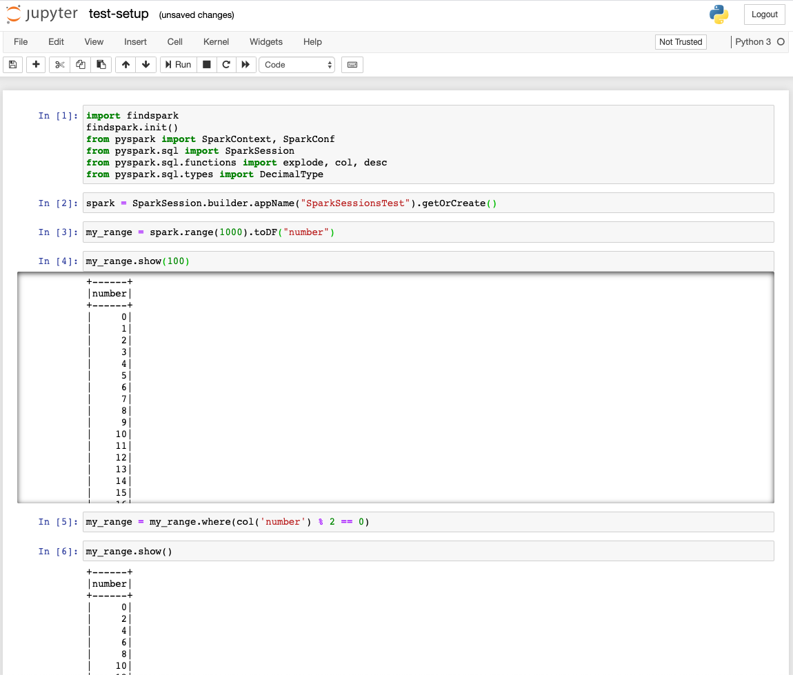

# Spark Sessions I [12/03/2020]
## Finding your inner Spark - Federico López Gómez


## Setting up your environment
### Requirements

- You need to have Java 8 installed, [I tried to run Spark using Java 11 and it didn't work](https://spark.apache.org/docs/latest/#downloading), so please make sure that you JAVA_HOME environment variable is pointing to your Java 8 installation directory.

    - In MacOS you can check it like this:
        - To know where is you JAVA_HOME pointing to:
            ```sh
            echo $JAVA_HOME
            ```
        - To find out which Java version you have installed and where are they:
            ```sh
            /usr/libexec/java_home -V
            ```
        - Choose the Java 8 version and set it as you JAVA_HOME:
            ```sh
            export JAVA_HOME=/Library/Java/JavaVirtualMachines/jdk1.8.0_152.jdk/Contents/Home
            ```
    
    - In a Debian based Linux distro you can check it using:
        - To know where is you JAVA_HOME pointing to:
            ```sh
            echo $JAVA_HOME
            ```
        - To find out which Java version you have installed and where are they:
            ```sh
            sudo update-alternatives --config java
          There are 2 choices for the alternative java (providing /usr/bin/java).
              Selection    Path                                     Priority   Status
            ------------------------------------------------------------------------------
              0            /usr/lib/jvm/java-11-oracle/bin/java      1091      auto mode
              1            /usr/lib/jvm/java-11-oracle/bin/java      1091      manual mode
            * 2            /usr/lib/jvm/java-8-oracle/jre/bin/java   1081      manual mode
            ```
        - Choose the Java 8 version and set it as you JAVA_HOME:
            ```sh
            export JAVA_HOME=/usr/lib/jvm/java-8-oracle/
            ```


- Install [Python 3.7](https://www.python.org/), if you don't have it already. [PySpark has an known issue running on Python 3.8](https://stackoverflow.com/questions/58700384/how-to-fix-typeerror-an-integer-is-required-got-type-bytes-error-when-tryin), so please make sure you are using Python 3.7. *Friendly reminder: [Python 2.7 IS DYING AND YOU SHOULD NOT USE IT ☠️](https://pythonclock.org/)*.


- Clone this repo:
    ```sh
    git clone https://github.com/ficolo/ebi-spark-sessions.git
    ```

- Go to the session directory:
    ```sh
    cd ebi-spark-sessions/finding-your-inner-spark
    ```

- Create a virtual environment using you brand new Python3 installation:
    ```sh
    python3 -m venv .venv
    ```
 
- If you have Python 3.8 installed, the easiest way to create a Python 3.7 virtual environment is using pyenv
    - To install pyenv in MacOS:
        ```sh
        brew install openssl readline sqlite3 xz zlib
        sudo installer -pkg /Library/Developer/CommandLineTools/Packages/macOS_SDK_headers_for_macOS_10.14.pkg -target /
        curl https://pyenv.run | bash
        ```
    - To install pyenv in Debian based OS:
        ```sh
        sudo apt-get install -y make build-essential libssl-dev zlib1g-dev libbz2-dev libreadline-dev libsqlite3-dev wget curl llvm libncurses5-dev libncursesw5-dev xz-utils tk-dev libffi-dev liblzma-dev python-openssl
        curl https://pyenv.run | bash
        ```
    - Installing Python 3.7 and creating a virtual environment using pyenv:
        ```sh
        pyenv install -v 3.7.5
        pyenv global 3.7.5
        python -V
        python -m venv .venv
        ```

- Activate your awesome virtual environment:
    ```sh
    source .venv/bin/activate
    ```

- Now lets get some nice Python packages to help us get going:
    ```sh
    pip install jupyter findspark
    ```

### Setting up your Spark environment
- First Download [Apache Spark](https://spark.apache.org/)
    ```sh
    wget http://apache.mirror.anlx.net/spark/spark-2.4.5/spark-2.4.5-bin-hadoop2.7.tgz
    tar -xzf spark-2.4.5-bin-hadoop2.7.tgz
    ```

- Let's set an environment variable for your Spark installation and the Spark local IP address:
    ```sh
    export SPARK_HOME=$(pwd)/spark-2.4.5-bin-hadoop2.7/
    export SPARK_LOCAL_IP="127.0.0.1"
    ```

### Testing your installation
 - Start Jupyter, this should open a new window of your browser with Jupyter:
     ```shell script
     jupyter notebook
    ```

- Open the **test-setup.ipynb** notebook:


- Run the notebook line by line using **Shift + Enter**, you should get an output like this:


## Troubleshoot

